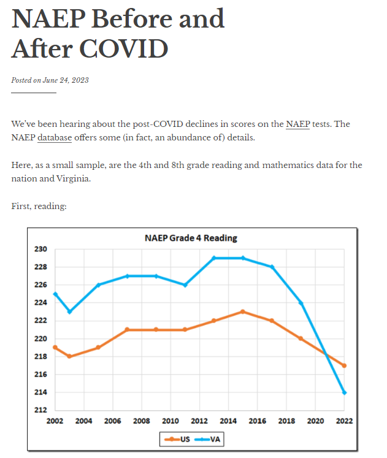
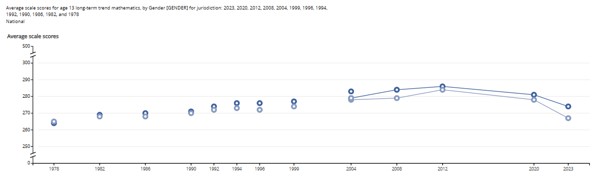
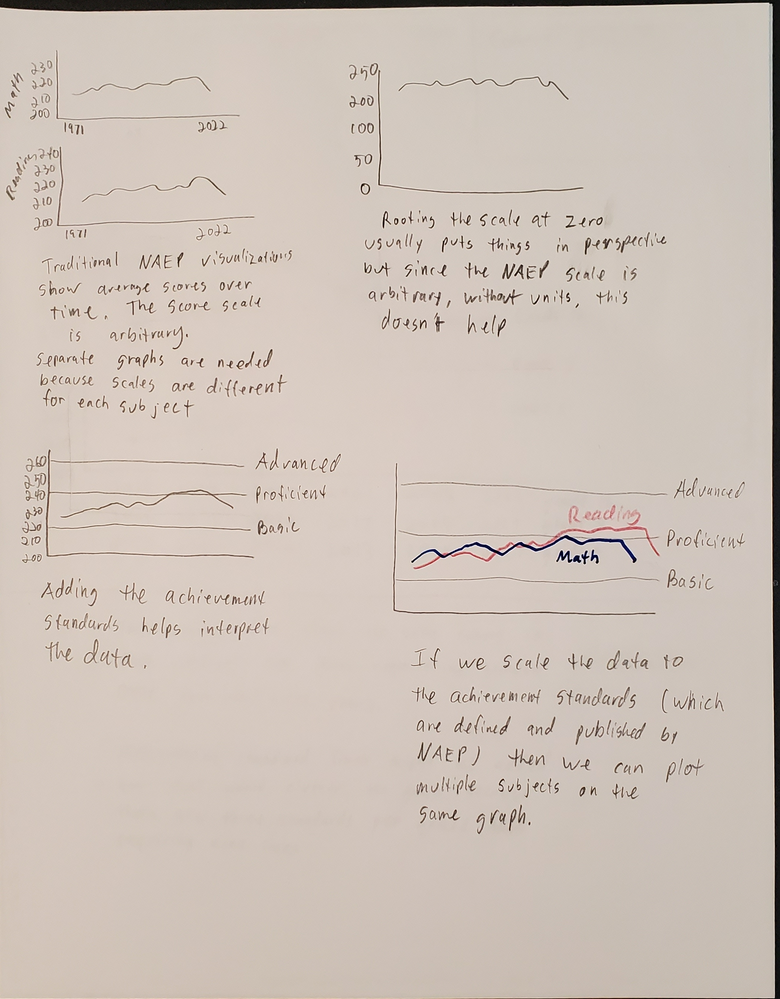
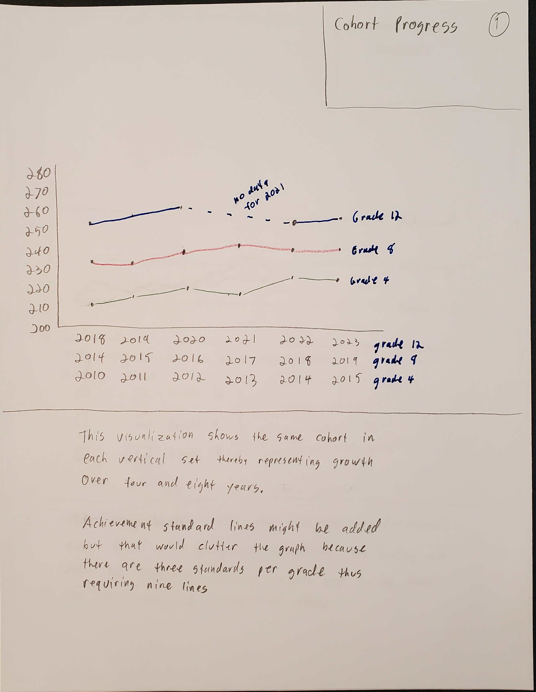
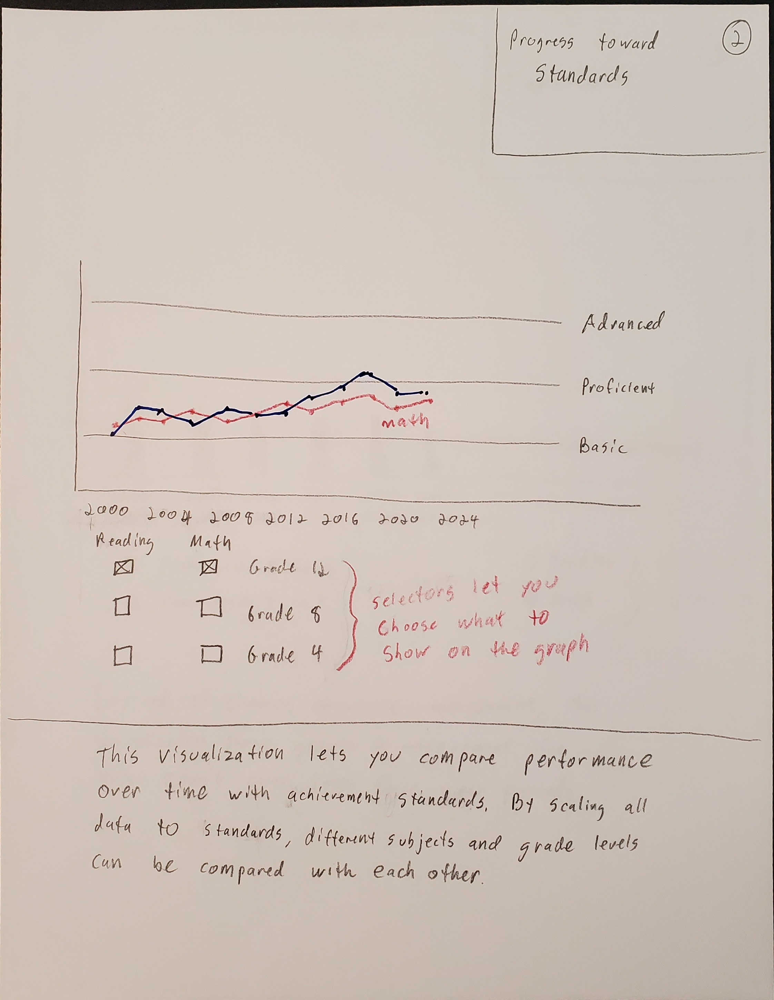
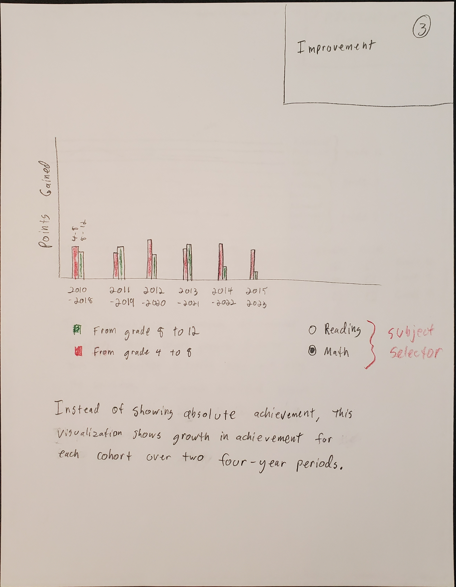
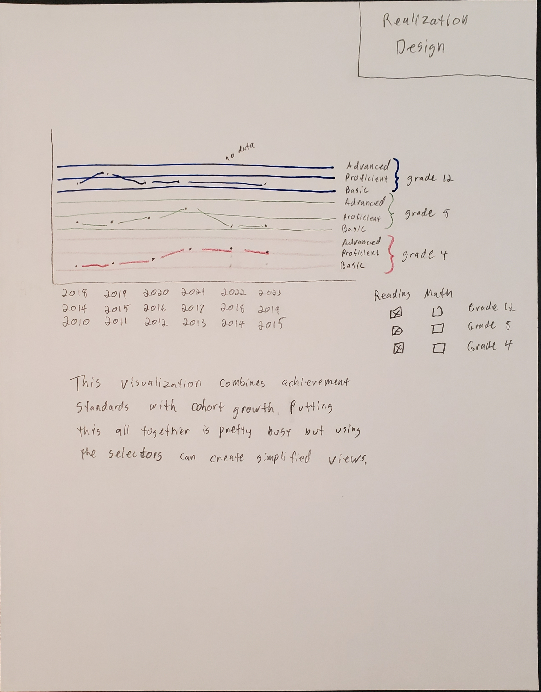
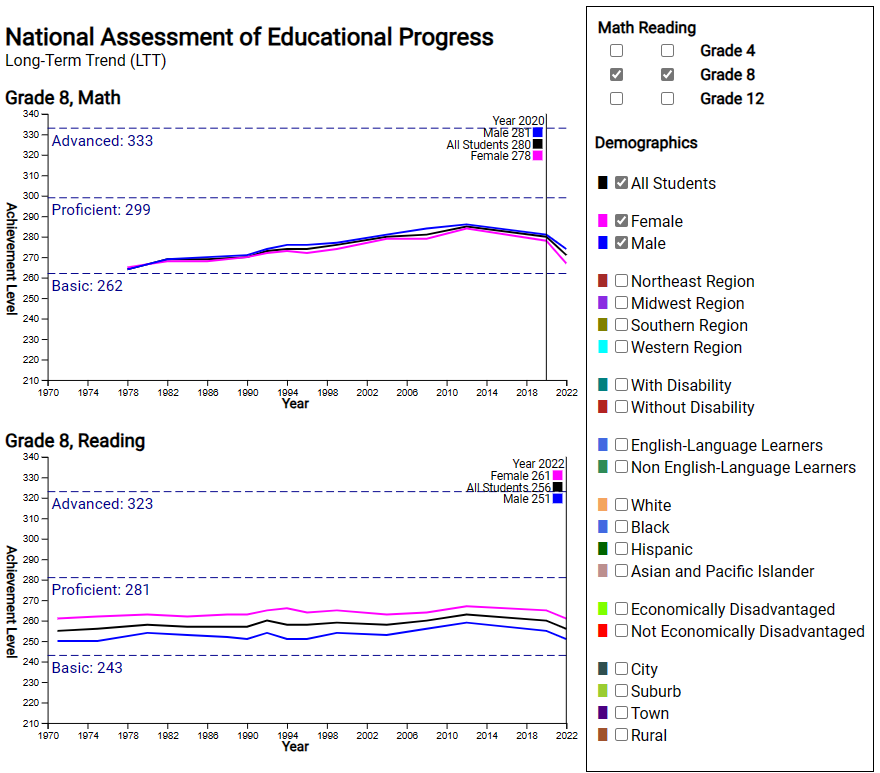
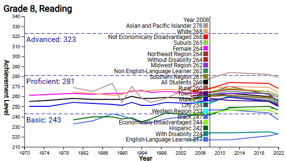

# Process Book - National Assessment of Educational Progress (NAEP)

## Basic Info

* Project Title: National Assessment of Educational Progress (NAEP)
* Name: **Brandt Redd** (Dr. Rosen gave me permission to do this project solo.)
* Email: **brandt.redd@utah.edu**
* UID: **u1419848**
* Repository: [https://github.com/dataviscourse2023/final-project-naep](https://github.com/dataviscourse2023/final-project-naep)

## Overview and Motivation

The [National Assessment of Educational Progress](https://nces.ed.gov/nationsreportcard/) is also known as ["The Nation's Report Card."](https://www.nationsreportcard.gov/). It has been administered regularly since 1971. Initially the assessment measured student proficiency in Reading and Mathematics at a national level. Over the years, state-level assessments in Math, Reading, Science, Civics and U.S. History have been added.

Recent NAEP results have been used to measure the impact of the COVID-19 pandemic on K-12 education in the U.S. This has resulted in sensational headlines and graphics like this one:

> {: style="border: solid black 1px;"} (Cranky's Blog [NAEP Before and After COVID](https://crankytaxpayer.wordpress.com/2023/06/24/naep-before-and-after-covid/))

Other headlines from articles referencing NAEP:

* PBS News Hour: [Test scores show how COVID set kids back across the U.S.](https://www.pbs.org/newshour/education/test-scores-show-how-covid-set-kids-back-across-the-u-s)
* National Assessment Governing Board: [First COVID-Era NAEP Assessment Shows Steep Declines In Mathematics and Reading for 9-Year-Olds](https://www.nagb.gov/news-and-events/news-releases/2022/2022-naep-long-term-trend-release.html)
* ReimanginED: ['Nation's Report Card': Two decades of growth wiped out by two years of pandemic](https://www.reimaginedonline.org/2022/09/nations-report-card-two-decades-of-growth-wiped-out-by-two-years-of-pandemic/)

The last one includes a graphic that I used as the subject for the visualization critique assignment.

There are plenty of existing visualizations of NAEP data including the official [The Nation's Report Card Website](https://www.nationsreportcard.gov/). Nevertheless, I think there are visualization methods that can do a better job. In particular, most visualizations attempt to represent progress in overall education but don't compare performance against achievement standards despite the fact that NAEP does set achievement standards for each subject.

## Related Work

NAEP is presently undergoing a comprehensive review process covering objectives, methods, reports, outcomes, budget and impact. I am a member of the budget review committee with focus on the technology costs and contracts. I was invited to participate due to my background in standardized student assessments and in assessment technology.

There are numerous existing examples of NAEP visualizations. Newspapers, websites, and blogs tend to generate graphs and run stories with each release. Some examples are linked to above. I have not found any interactive visualizations except for those on the official NAEP site, [Nation's Report Card - Data Explorer](https://www.nationsreportcard.gov/ndecore/xplore/ltt). The existing interactions require multiple steps to generate a graph and limit your ability to compare performance across demographic groups, subjects, or grades.

Here is an example of a chart created from that site. The interactive part is the process of creating what to view; about eight confusing steps. Once the graphic is created, there's no interaction. 

## Questions (Project Objectives)

I targeted the new NAEP visualization at the following questions:

* How significant has progress been over the last 2-3 decades?
* Has progress in U.S. education really been "wiped out" by the pandemic?
* How does achievement and progress compare between different groups of students (gender, race/ethnicity, region, economic disadvantage, etc.)?
* How successful are efforts such as the No Child Left Behind Act and the Every Student Succeeds Act.

## Data

NAEP is administered by the [National Center for Educational Statistics](https://nces.ed.gov) which provides a wealth of educational data in raw and processed form. In the case of NAEP, I used the [NAEP Data Explorer](https://www.nationsreportcard.gov/ndecore/landing) to download data from the Long-Term Trend assessments in tabular form. 

I found two ways to download the detailed data . One is through an API that would require quite a bit of programming because it only seems to produce one data point per call. The other is by querying for the appropriate data and then copying the table and pasting it into Excel. There are three grades, two subjects, and eight categories for a total of 48 query-copy-paste operations.

It took a while, but I chose the query-copy-paste method. I also had to look up the achievement standard levels which are posted elsewhere on the website. With all of that in place, I exported the spreadsheet from Excel into .csv format and wrote a script to convert it all into JSON which I incorporated into the project. In addition to the performance data, the JSON file includes the maxima and minima for each data set (grade and subject), the years that the assessment was administered, and the range that should be represented in the graph.

## Exploratory Data Analysis

I explored the data both during export and then by examining it in Excel. The eight categories result in 21 data series. For example, Region has four series: Northeast, South, Midwest, and West. Some of the series do not cover the entire date range so the visualization needs to accommodate abbreviated data sets.

There are two subjects and three grades for a total of six assessments. While they are all on the same scale, comparing grades to each other or comparing subjects to each other doesn't yield useful insight - especially since the achievement levels are different for each of the six tests. Therefore, I determined to render separate graphs for each grade-subject category. Nevertheless, the same range is used for both subjects (Reading and Math) in the same grade thereby keeping the vertical scale consistent.

On the other hand, the different series can be displayed as lines on the same graph. Showing all 21 at once makes it hard to distinguish the lines so another interaction allows the user to select one or more series to be shown and compared.

## Design Evolution

Here are the brainstorming and initial designs that I prepared as part of the proposal.

{: style="max-width: 30em;"}

### Initial Design 1

{: style="max-width: 30em;"}

### Initial Design 2
{: style="max-width: 30em;"}

### Initial Design 3
{: style="max-width: 30em;"}

### Realization Design
{: style="max-width: 30em;"}

Most of the concepts are familiar line charts. While we have discussed more advanced visualizations in class, it was emphasized that position is the strongest indicator and that familiar visualizations are easier to interpret.

Specifically, lines are good to show change in the same measure over time and that's the type of data being shown. Multiple lines on the same chart can make it easy to compare so long as there aren't too many lines.

I also considered using bar charts to compare growth in achievement between different groups. But, having rendered the actual line charts, I found that achievement growth is easy to perceive and chose not to use bar charts.

In the initial designs I considered scaling the values to the achievement levels. Doing so would make it possible to show multiple grades or different subjects on the same graph while still being faithful to the data. However, as we discussed in class, the purpose of putting multiple lines on the same graph is to facilitate comparison. It's not appropriate to compare performance on one grade with another. Nor is it appropriate to compare performance between subjects.

In the final result I elected to have multiple graphs aligned to each other so that common trends are easily seen but inappropriate comparison of values is discouraged. The result is more conventional than the initial and realization designs. I hope that sticking to convention will ensure that data are interpreted correctly. Similar to homework 4, the graphs respond to mouseover events by showing detailed numbers for the year. The year display helps in interpreting the data since NAEP tests are not given every year and the interval has been irregular.

## Implementation

Here is a screenshot of the final visualization with both Grade 8 graphs displayed and the All, Female, and Male demographics selected. I used a **Responsive Design** so a wider screen will show graphs side-by-side while a narrower screen stacks them as shown in the screenshot.

{: style="max-width: 40em; border: solid black 1px;"}

The lines are plotted in the context of the three achievement levels which I have not found in any other NAEP rendering. I combined the interactive demographic selection with the legend to save space and I found that the combination works quite well. The mouse hover shows the actual figures for a particular year sorted from high to low.

Selecting all 21 demographic categories results in a very busy graph as shown below. Nevertheless, the mouseover display this rendering helpful for when identifying outliers due to the ordering from high to low.

{: style="max-width: 40em; border: solid black 1px;"}

The data are loaded from a single JSON file that includes both subjects, the three grades and all data series. The data are organized in a way that makes it easy to generate the graphs Implementation is in JavaScript using the D3 library. Graphs render to SVG.

## Evaluation

Here is my self-evaluation of the visualization.

### Learnings From the data

When the graphs are compared with the achievement levels it becomes clear that scholastic achievement in the U.S has changed very little since the 1970s. To be sure there has been an upward trend but the all lines remain below the "Proficient" achievement level with the exception of the "Asian and Pacific Islander" demographic. The negative impact of the COVID-19 pandemic is strongly evident. However, data from the next one or two NAEP administrations will be required before we can conclude that progress has been "wiped out." A rapid recovery possible.

The graphs confirm that Black and Hispanic minorities continue to underperform despite decades of interventions on their behalf. Those populations were also disproportionately affected by the pandemic.

### Answering Questions

These are the questions from the project objectives:

**How significant has progress been over the last 2-3 decades?** There has been progress but it has been limited when compared with achievement levels. Even before the pandemic there has was an overall decline since 2012.

**Has progress in education really been "wiped out" by the pandemic?** Certainly the group of students tested in 2022 performed worse than the prior group. This was immediately after the pandemic lockdowns. To tell whether this truly wiped out progress will require more time. It may be that students and schools recover quickly and make up for the lost time. Regardless, the loss in achievement is just as small as the gains have been.

**How does achievement and progress compare between different groups of students (gender, race/ethnicity, region, economic disadvantage, etc.)?** Male students consistently perform better in math while female students perform better at reading. Asian and Pacific Islander students achieve better than all other demographic groups. While black and hispanic students are the lowest performers of the major demographics, their gains up until 2012 were greater than other groups. Exactly why there has been a decline since 2012 is hard to tell but it affects all demographics. The lowest-performing groups are English-Language Learners (ELLs) and those with disabilities. However the low performance of ELLs doesn't tell the whole story. From other sources I know that ELLs usually graduate from that program and category within 2-3 years and, therefore, their subsequent achievement is included in the overall demographic.

**Note:** In my proposal I had a question about gains for cohorts of students. I intended to compare test results for a cohort in the 8th grade to that same group in the 4th grade, and the same for 12th and 8th. However, I discovered that the intervals between NAEP tests are inconsistent thereby preventing such comparisons. Accordingly, I updated to a new question.

**How successful are efforts such as the No Child Left Behind Act and the Every Student Succeeds Act.** No Child Left Behind (NCLB) was passed in 2001 and its replacement, the Every Student Succeeds Act (ESSA) was passed in 2015. The graphs do not show a significant inflection point associated with 2001. However, the overall decline between the 2012 and 2020 tests could be associated with ESSA. Regardless, NAEP results suggest that neither act was successful in significantly improving student learning in Reading or Mathematics.

### Visualization Functionality and Improvement

Overall, I'm pleased with the visualization. Even a graph with all demographics turned on can be interpreted through the use of the mouseover interaction. It's easy to answer questions about relative demographic performance. Despite subjects and grades being in different graphs it's easy to compare the trends due to their relative layouts. If I were to make further improvements my first step would be to extend to other NAEP data beyond the Long-Term Trends for Reading and Mathematics. The NAEP suite includes other subjects and has state-level achievement data though not for the long time span represented here.

My sobering conclusion is that, despite a lot of sincere effort, improvements in U.S. student learning have been very small over the last four decades.