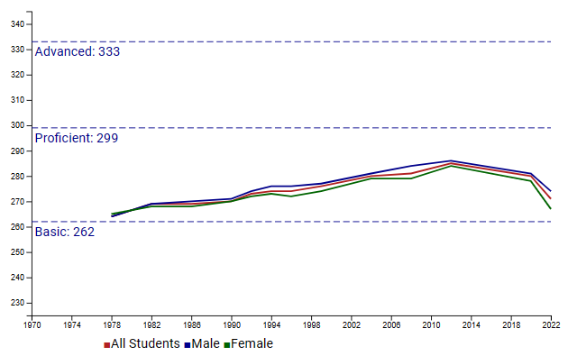

# Process Book - National Assessment of Educational Progress (NAEP)

## Basic Info

* Project Title: National Assessment of Educational Progress (NAEP)
* Name: **Brandt Redd** (Dr. Rosen gave me permission to do this project solo.)
* Email: **brandt.redd@utah.edu**
* UID: **u1419848**
* Repository: [https://github.com/dataviscourse2023/final-project-naep](https://github.com/dataviscourse2023/final-project-naep)

## Overview and Motivation
(Abbreviated from the Proposal)

The [National Assessment of Educational Progress](https://nces.ed.gov/nationsreportcard/) is also known as ["The Nation's Report Card."](https://www.nationsreportcard.gov/) It has been administered every regularly since 1969.Initially the assessment measured student proficiency in Reading and Mathematics at a national level. Over the years, state-level assessments in Math, Reading, Science, Civics and U.S. History have been added.

NAEP results have been used to measure the impact of the COVID-19 pandemic on K-12 education in the U.S. This has resulted in sensational headlines and graphics like this one:

>  (Cranky's Blog [NAEP Before and After COVID](https://crankytaxpayer.wordpress.com/2023/06/24/naep-before-and-after-covid/))

Other headlines from articles referencing NAEP:

* PBS News Hour: [Test scores show how COVID set kids back across the U.S.](https://www.pbs.org/newshour/education/test-scores-show-how-covid-set-kids-back-across-the-u-s)
* National Assessment Governing Board: [First COVID-Era NAEP Assessment Shows Steep Declines In Mathematics and Reading for 9-Year-Olds](https://www.nagb.gov/news-and-events/news-releases/2022/2022-naep-long-term-trend-release.html)
* ReimanginED: ['Nation's Report Card': Two decades of growth wiped out by two years of pandemic](https://www.reimaginedonline.org/2022/09/nations-report-card-two-decades-of-growth-wiped-out-by-two-years-of-pandemic/)

The last one includes a graphic that I used as the subject for the visualization critique assignment.

There are plenty of existing visualizations of NAEP data including the official [The Nation's Report Card Website](https://www.nationsreportcard.gov/). Nevertheless, I think there are visualization approaches that can do a better job. In particular, most visualizations attempt to represent progress in overall education but don't compare performance against achievement standards despite the fact that NAEP does set achievement standards for each subject. Also, existing visualizations don't attempt to track progress of the same cohort of students over time.

## Related Work

NAEP is presently undergoing a comprehensive review process covering objectives, methods, reports, outcomes, budget and impact. I am a member of the budget review committee with focus on the technology costs and contracts. I was invited to participate due to my background in standardized student assessments and in assessment technology.

There are numerous existing examples of NAEP visualizations. Newspapers, websites, and blogs tend to generate graphs and run stories with each release. Some examples are above. I have not found any interactive visualizations except for those on the official NAEP site, [Nation's Report Card - Data Explorer](https://www.nationsreportcard.gov/ndecore/xplore/ltt)

Here is an example of a chart created from that site. The interaction is in the process of creating what to view. And that takes about eight confusing steps. Once the graphic is created, there's no interaction. 

## Questions (Project Objectives)

I am targeting the new NAEP visualization at the following questions:

* How significant has progress been over the last 2-3 decades?
* Has progress in U.S. education really been "wiped out" by the pandemic?
* How does achievement and progress compare between different groups of students (gender, race/ethnicity, region, economic disadvantage, etc.)?
* How successful are efforts such as the No Child Left Behind Act and the Every Student Succeeds Act.

## Data

NAEP is administered by the [National Center for Educational Statistics](https://nces.ed.gov) which provides a wealth of educational data in raw and processed form. In the case of NAEP, I used the [NAEP Data Explorer](https://www.nationsreportcard.gov/ndecore/landing) to download Long-Term Trend data in tabular form. 

I found two ways to download the detailed data . One is through an API that would require quite a bit of programming because it only seems to produce one data point per call. The other is by querying for the appropriate data and then copying the table and pasting it into excel. Still, there are three grades, two subjects, and eight categories for a total of 48 query-copy-paste operations.
It took a while, but I got the data that way. I also had to look up the achievement standard levels which are posted elsewhere on the website. With all of that in place, I exported the spreadsheet from Excel into .csv format and wrote a script to convert it all into JSON which I incorporated into the project.

## Exploratory Data Analysis

I explored the data both during export and then by examining it in Excel. The eight categories result in 21 data series. For example, Region has four series: Northeast, South, Midwest, and West. Some of the series do not cover the entire date range so the visualization needs to accommodate abbreviated data sets.

There are two subjects and three grades for a total of six assessments. While they are all on the same scale, comparing grades to each other or comparing subjects to each other doesn't yield useful insight - especially since the achievement levels are different for each of the six tests. Therefore, I expect to render separate graphs for each of the six. One interaction will be to select which graphs to show.

On the other hand, the different series can be displayed as lines on the same graph. Showing all 21 at once will be too busy son another interaction will be to determine which series' to show.

## Design Evolution

Here are the brainstorming and initial designs that I prepared as part of the proposal.

### Initial Design 1

### Initial Design 2

### Initial Design 3

### Realization Design

All of the concepts are familiar line charts. While we have discussed more advanced visualizations in class, it was emphasized that position is the strongest indicator and that familiar visualizations are easier to interpret.

Specifically, lines are good to show change in the same measure over time and that's the type of data being shown. Multiple lines on the same chart can make it easy to compare so long as there aren't too many lines.

In the initial designs I considered scaling the values to the achievement levels. Doing so would make it possible to show multiple grades or different subjects on the same graph while still being faithful to the data. However, as we discussed in class, the purpose of putting multiple lines on the same graph is to facilitate comparison. It's not appropriate to compare performance on one grade grades with another. Nor is it appropriate to compare performance on between subjects. Therefore, I elected to have multiple graphs aligned to each other so that common trends are easily seen but inappropriate comparison of values is not encouraged.

I also considered using bar charts to compare growth in achievement between different groups. But, having rendered the actual line charts, I found that achievement growth is easy to perceive and chose not to use bar charts.

## Implementation

Here's a screenshot of the mathematics visualization as of the Milestone report:

It has multiple lines and the graph shows them relative to the achievement levels. At present, the lines are hard-coded to All Students (red), Male (blue) and Female (green) and the legend is at the bottom. The interactive version will show a dynamic legend as you hover the mouse over the graph. The legend will include the actual numbers for the year being hovered over.

The data are loaded from a single JSON file that includes both subjects, the three grades and all data series. The data are organized in a way that makes it easy to generate the graphs.

Implementation is in JavaScript using the D3 library. Graphs render to SVG.

## Evaluation

This is a preliminary evaluation. I will write the full evaluation when the project is complete.

### Learnings From the data

When the graphs are compared with the achievement levels, something other visualizations don't do, it becomes clear that scholastic achievement in the U.S has changed very little since the 1970s. To be sure there has been an upward trend but the lines remain below the "Proficient" achievement level.

In the the final evaluation I expect to be able to comment on difference among demographic groups.

### Answering Questions

These are my original questions from the proposal:

**How significant has progress been over the last 2-3 decades?** As described above. There has been progress but it's limited when compared with achievement levels.

**Has progress in education really been "wiped out" by the pandemic?** Certainly the group of students tested in 2022 performed worse than the prior group. This was immediately after the pandemic lockdowns. To tell whether this truly wiped out progress will require more time. It may be that students and schools recover quickly and make up for the lost time.

**For the same cohorts of students, what was the direct impact on progress?** To answer this question, I intended to compare test results for a cohort in the 8th grade to that same group in the 4th grade, and the same for 12th and 8th. However, I found that the intervals between NAEP tests are inconsistent thereby preventing such comparisons.

As a substitute, I am implementing comparisons of demographic groups. That will be available in the final version.

### Visualization Functionality and Improvement

This initial version of the visualization is static. Nevertheless, it shows valuable information. Improvements will include selections of which graphs to show (by subject and grade) and which demographic lines to show. Hovering over the graphs will give the exact numbers for each line.