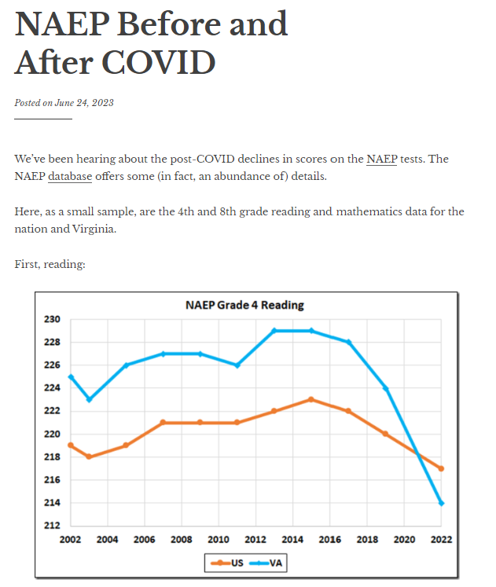

# Project Proposal - National Assessment of Educational Progress (NAEP)

## Basic Info

* Project Title: National Assessment of Educational Progress (NAEP)
* Name: **Brandt Redd** (Dr. Rosen gave me permission to do this project solo.)
* Email: **brandt.redd@utah.edu**
* UID: **u1419848**
* Repository: [https://github.com/dataviscourse2023/final-project-naep](https://github.com/dataviscourse2023/final-project-naep)

## Background and Motivation

The [National Assessment of Educational Progress](https://nces.ed.gov/nationsreportcard/) is also known as ["The Nation's Report Card."](https://www.nationsreportcard.gov/) It has been administered every year since 1969 except for 2021 when it was suspended due to the pandemic. Initially the assessment measured student proficiency in Reading and Mathematics at a national level. Over the years, state-level assessments in Math, Reading, Science, Civics and U.S. History have been added.

NAEP is currently undergoing a Cost Structure Review and I am the assessment technology representative on the advisory committee for that review.

The general NAEP results have been used to measure the impact of the COVID-19 pandemic on K-12 education in the U.S. This has resulted in sensational headlines and graphics like this one:

 (Cranky's Blog [NAEP Before and After COVID](https://crankytaxpayer.wordpress.com/2023/06/24/naep-before-and-after-covid/))

Other headlines from articles referencing NAEP:

* PBS News Hour: [Test scores show how COVID set kids back across the U.S.](https://www.pbs.org/newshour/education/test-scores-show-how-covid-set-kids-back-across-the-u-s)
* National Assessment Governing Board: [First COVID-Era NAEP Assessment Shows Steep Declines In Mathematics and Reading for 9-Year-Olds](https://www.nagb.gov/news-and-events/news-releases/2022/2022-naep-long-term-trend-release.html)
* ReimanginED: ['Nation's Report Card': Two decades of growth wiped out by two years of pandemic](https://www.reimaginedonline.org/2022/09/nations-report-card-two-decades-of-growth-wiped-out-by-two-years-of-pandemic/)

The last one includes a graphic that I used as the subject for the visualization critique assignment.

In developing visualizations on NAEP data I have competition including the official [The Nation's Report Card Website](https://www.nationsreportcard.gov/). Nevertheless, I think there are visualization approaches that can do a better job. In particular, most visualizations attempt to represent progress in overall education but don't compare achievement against performance standards despite the fact that NAEP does set performance objectives for each subject. Also, existing visualizations don't attempt to track progress of the same cohort of students over time.

## Project Objectives

I am targeting the new visualization at the following questions:

* How significant has progress been over the last 2-3 decades?
* Has progress in education really been "wiped out" by the pandemic?
* For the same cohorts of students, what was the direct impact on progress?
* (Stretch Goal) How do different states differ in the answers to the above questions?

## Data

NAEP is administered by the [National Center for Educational Statistics](https://nces.ed.gov) which provides a wealth of educational data in raw and processed form. In the case of NAEP, I will use the [NAEP Data Explorer](https://www.nationsreportcard.gov/ndecore/landing) to download national and state-level data in tabular form. I have not yet decided exactly which data I will utilize but it will probably be reading and mathematics either on the national scale or at the state level. NAEP uses different assessments at the national and state levels so I will need to examine what are the advantages of each test before determining which to use.

## Data Processing

NAEP exports raw data in Excel (XLS) format as well as formatted reports in PDF, HTML, and DOC formats. I will use the Excel format and then convert from that to JSON for easy loading by JavaScript. While Excel has a direct JSON export option I may find it better to export from Excel to CSV and then write a script that generates JSON that's best-suited to the visualization.

## Visualization Design

The test is administered in grades 4, 8, and 12. One thing I want to do, that I have not seen in any other NAEP visualization, is compare cohorts of students over time. For example, I want to compare the 8th grade students from one year with the 12th grade students four years later. This should give a measure of educational growth and we can see how that growth measure changes year over year.

## Must-Have Features

* Comparison of student achievement with standards for proficiency.
* Measures of growth for across four-year spans (4th grade to 8th grade and 8th grade to 12th grade).
* Indications of the impact of COVID-19.
* At least two subject: Reading and Mathematics

## Optional Features

* State-level renderings.
* Forecast of COVID-19 recovery. (I'm not sure whether this is possible with the data.)
* Additional subjects (Science, Civics, U.S. History)

## Project Schedule